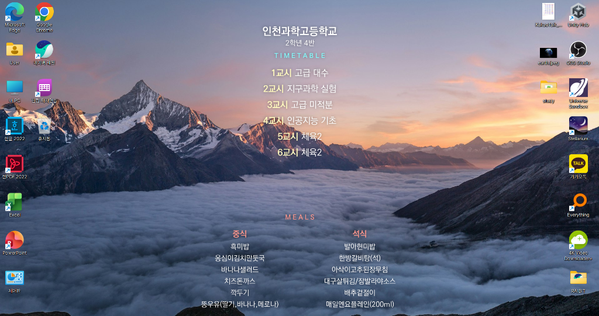

# School Wallpaper Sync (Daily Timetable & Meal Scheduler)

A Windows desktop assistant that automatically syncs and displays your daily class timetable, school meals, and upcoming school-schedule D-Days directly on an aesthetic desktop wallpaper.



---

## ✨ Features

- **Real-time Sync**: Fetches your today's timetable and meals via the official [NEIS Open API](https://open.neis.go.kr).
- **D-Day Countdown**: Shows the nearest upcoming school-schedule events (holidays, exams, ceremonies, etc.), right-aligned on one line. Pulls automatically from NEIS, and you can add your own entries (e.g. exam dates NEIS doesn't publish) with an optional custom color per entry — manual entries always get priority over automatic ones.
- **Aesthetic Backgrounds**: Automatically rotates daily through 8 built-in premium wallpapers, or pin one you like, or use your own photo.
- **Minimalist Layout**: Clean typography directly on the wallpaper, no cards or boxes.
- **Fully Automatic Updates**: The first time you apply, it registers itself in Windows (startup + a repeating scheduled task) so your timetable/meals/D-Day keep refreshing on their own — nothing to set up by hand, and no need to keep any app open.
- **Settings GUI**: Configure your school, background, and D-Day entries, and fine-tune every element's position/size/color/shadow with a live preview synced to your desktop as you drag.

---

## 🚀 How to Get Started

1. Download and run `SchoolWallpaperSettings.exe` (from a [Release](../../releases/latest) or built yourself, see below).
2. On the **기본 설정** tab: type your school name, hit 검색, pick your school from the results, then enter your grade and class.
3. Pick a background: automatic daily rotation, a fixed one of the 8 built-ins, or your own photo file.
4. Click **저장 및 지금 적용**. Your wallpaper updates immediately, and from then on it keeps itself up to date automatically — you don't need to do anything else.
5. (Optional) On the **글자 색상 설정** and **배치 및 효과 설정** tabs, adjust colors, position, font size, and shadows per element — changes preview live on your desktop as you move the sliders. Add manual D-Day entries (e.g. exam dates) on the D-Day sub-tab if NEIS doesn't have them for your school.

---

## 🛠️ Building from Source

```bash
pip install pillow requests
build.bat
```

This produces `SchoolWallpaperSettings.exe` in the project root. `main.py` is the engine (also runnable standalone with `--background` for silent updates, or `--reset` to clear saved settings); `settings_gui.py` is the GUI; `app.py` is the entry point that picks between them.

---

## 🎨 License

Feel free to use and modify for personal purposes. Keep your study and meals organized beautifully!
